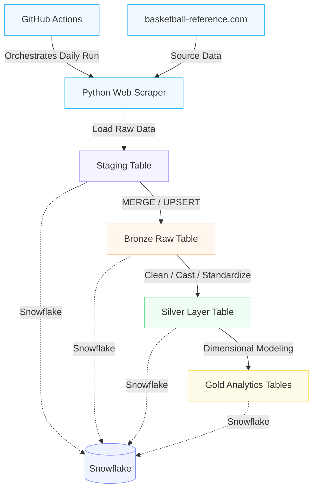

```mermaid
graph TD
    GitHubActions[GitHub Actions]
        -->|Orchestrates Daily Run| WebScraper[Python Web Scraper]

    BasketballRef[basketball-reference.com]
        -->|Source Data| WebScraper

    WebScraper
        -->|Load Raw Data| StagingTable[Staging Table]

    StagingTable
        -->|MERGE / UPSERT| BronzeTable[Bronze Raw Table]

    BronzeTable
        -->|Clean / Cast / Standardize| SilverTable[Silver Layer Table]

    SilverTable
        -->|Dimensional Modeling| GoldTable[Gold Analytics Tables]

    StagingTable -.->|Snowflake| SnowflakeDB[(Snowflake)]
    BronzeTable -.->|Snowflake| SnowflakeDB
    SilverTable -.->|Snowflake| SnowflakeDB
    GoldTable -.->|Snowflake| SnowflakeDB

    classDef source stroke:#38bdf8,fill:#f0f9ff
    classDef process stroke:#a78bfa,fill:#f5f3ff
    classDef bronze stroke:#fb923c,fill:#fff7ed
    classDef silver stroke:#4ade80,fill:#f0fdf4
    classDef gold stroke:#facc15,fill:#fefce8
    classDef storage stroke:#818cf8,fill:#eef2ff

    class GitHubActions,WebScraper,BasketballRef source
    class StagingTable process
    class BronzeTable bronze
    class SilverTable silver
    class GoldTable gold
    class SnowflakeDB storage
```